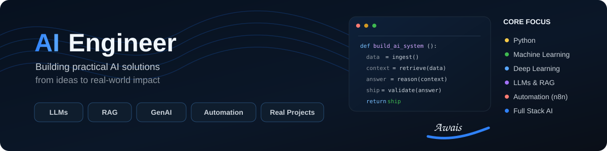
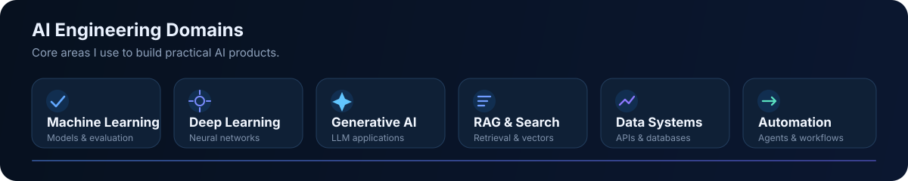
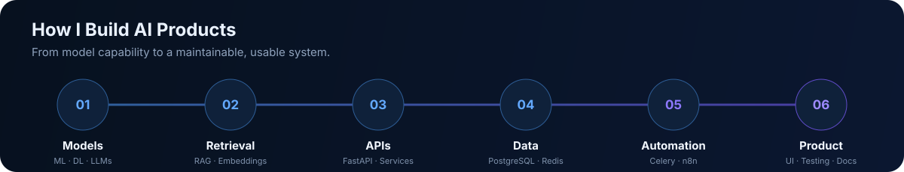

  

  
  
  

## About Me

I'm **Awais Irshad**, an AI Engineer focused on building practical systems around **Machine Learning, Deep Learning, Generative AI, LLMs, RAG, data pipelines, APIs, databases, and automation**.

I enjoy taking an idea beyond a notebook and turning it into a usable product: backend services, retrieval systems, structured AI workflows, dashboards, databases, testing, and deployment-ready architecture.

- Building applied AI products with **Python, FastAPI, PostgreSQL, Redis, Next.js, TypeScript, and Docker**
- Working with **LLMs, RAG, embeddings, vector search, LangChain/LangGraph, and GenAI workflows**
- Automating business processes with **n8n, Celery, and API-driven systems**
- Using modern AI-assisted engineering workflows with tools such as **Codex and Claude Code**
- Open to **Junior AI Engineer, Applied AI, Machine Learning, and AI Automation** opportunities

## Tech Stack

  

  <code>Machine Learning</code> · <code>Deep Learning</code> · <code>Generative AI</code> · <code>LLMs</code> · <code>RAG</code> · <code>Embeddings</code> · <code>Vector Search</code> 
  <code>LangChain</code> · <code>LangGraph</code> · <code>PostgreSQL</code> · <code>pgvector</code> · <code>Redis</code> · <code>Celery</code> · <code>n8n</code> · <code>Pytest</code>

## Featured Projects

<table>
<tr>
<td width="50%" valign="top">

### 🚀 [TenderScout AI](https://github.com/awais-ai-engineer/tenderscout-ai)
AI-powered procurement intelligence platform for tender discovery, structured analysis, RAG-based Q&A, company matching, saved opportunities, alerts, and background processing.

`Python` `FastAPI` `PostgreSQL` `pgvector` `Celery` `Next.js` `RAG`

</td>
<td width="50%" valign="top">

### 📄 [InsightDoc-RAG](https://github.com/awais-ai-engineer/InsightDoc-RAG)
Document intelligence and Q&A workflow built around retrieval-augmented generation, semantic retrieval, and source-aware responses.

`Python` `RAG` `Embeddings` `LLMs` `Vector Search`

</td>
</tr>
<tr>
<td width="50%" valign="top">

### 📊 [LedgerIQ-AI](https://github.com/awais-ai-engineer/LedgerIQ-AI)
AI-focused financial intelligence project for transaction analysis, anomaly detection, forecasting, and assisted summaries.

`Python` `Pandas` `Machine Learning` `Data Analysis` `FinTech`

</td>
<td width="50%" valign="top">

### 🛒 [Ecommerce Price Intelligence](https://github.com/awais-ai-engineer/Ecommerce-Price-Intelligence)
Price intelligence pipeline combining data collection, historical analysis, ML-based prediction, and dashboard-style insights.

`Python` `Data Pipelines` `Machine Learning` `Analytics` `Automation`

</td>
</tr>
</table>

## AI Engineering Domains

  

## Engineering Approach

  

I prefer systems that are **useful, explainable, maintainable, and testable**. My focus is not only on model output, but on the full engineering path around it: data ingestion, retrieval, API design, persistence, background jobs, product UX, validation, and documentation.

## GitHub Activity

  
  

---

  <b>Building practical AI systems that connect models, data, retrieval, APIs, databases, and automation.</b> 
  Pakistan · Open to AI engineering opportunities and collaborative projects

