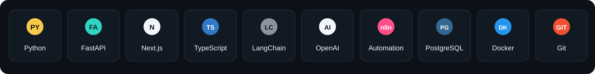

  

  <b>AI Engineer building real-world AI products with LLMs, RAG, Machine Learning, Deep Learning, and automation.</b>

  📍 Lahore, Pakistan &nbsp;•&nbsp;
  <a href="mailto:contactbyawais@gmail.com">contactbyawais@gmail.com</a> &nbsp;•&nbsp;
  <a href="https://www.linkedin.com/in/awais-ai-engineer">LinkedIn</a> &nbsp;•&nbsp;
  <a href="https://github.com/awais-ai-engineer">GitHub</a>

## Tech Stack

  

  <code>Machine Learning</code> · <code>Deep Learning</code> · <code>Generative AI</code> · <code>LLMs</code> · <code>RAG</code> · <code>Embeddings</code> · <code>Vector Search</code> 
  <code>LangChain</code> · <code>LangGraph</code> · <code>pgvector</code> · <code>Redis</code> · <code>Celery</code> · <code>n8n</code> · <code>Pytest</code>

## Pinned Repositories

<table>
<tr>
<td width="50%" valign="top">

### 🚀 [TenderScout AI](https://github.com/awais-ai-engineer/tenderscout-ai)
AI-powered procurement intelligence platform for tender discovery, structured analysis, document processing, RAG-based Q&A, explainable company matching, alerts, and background workflows.

`Python` `FastAPI` `PostgreSQL` `pgvector` `Celery` `Next.js` `RAG`

</td>
<td width="50%" valign="top">

### 📄 [InsightDoc-RAG](https://github.com/awais-ai-engineer/InsightDoc-RAG)
Document question-answering with parsing, chunking, embeddings, ChromaDB retrieval, and source-aware LLM responses.

`Python` `Sentence Transformers` `ChromaDB` `LLMs` `Streamlit`

</td>
</tr>
<tr>
<td width="50%" valign="top">

### 📊 [LedgerIQ-AI](https://github.com/awais-ai-engineer/LedgerIQ-AI)
AI-assisted financial intelligence for transaction cleaning, categorization, anomaly review, budgeting, forecasting, and business summaries.

`Python` `Pandas` `scikit-learn` `Isolation Forest` `Streamlit`

</td>
<td width="50%" valign="top">

### 🛒 [Ecommerce Price Intelligence](https://github.com/awais-ai-engineer/Ecommerce-Price-Intelligence)
End-to-end price intelligence pipeline for collection, historical tracking, ML prediction, Buy/Wait decision support, and dashboard exploration.

`Python` `Selenium` `SQLite` `Random Forest` `Streamlit` `Pytest`

</td>
</tr>
</table>

## Contributions & GitHub Stats

<table>
<tr>
<td width="66%" valign="top">
  
</td>
<td width="34%" valign="top">
  
</td>
</tr>
</table>

  

---

  <b>Awais Irshad — AI Engineer</b> 
  Building practical AI systems from models, data, retrieval, APIs, databases, and automation.

